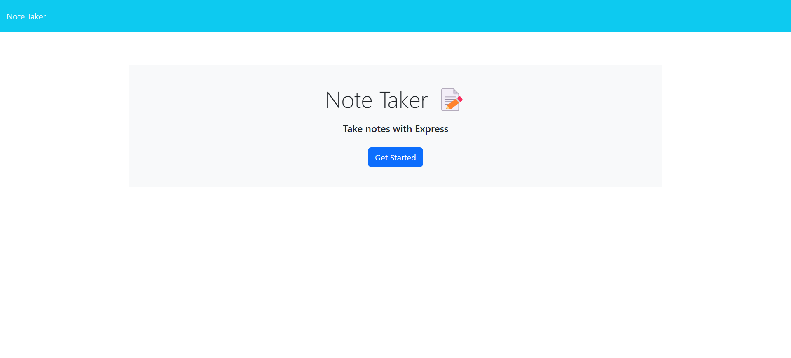
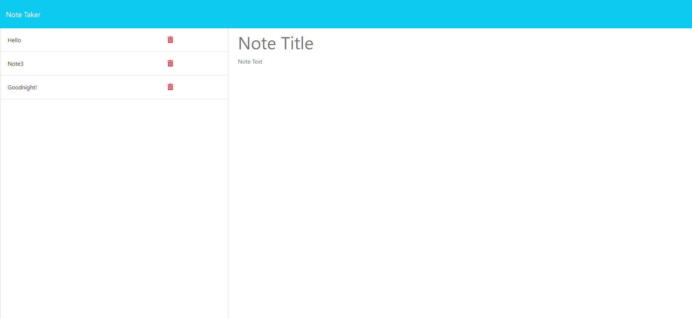

# Make a Note

## Description
Created the backend functionality of the given front end website to take notes.

## Table of Contents
[Technology Used](#technology-used) 
[Usage](#usage) 
[Learning Points](#learning-points) 
[Credits](#credits) 
[Author](#author) 

## Technology Used
|Technology Name|Resource|
|-----------|------------|
|JavaScript|[link](https://www.w3schools.com/js/js_intro.asp)|
|CSS|[link](https://www.w3schools.com/css/css_intro.asp)|
|Git|[link](https://www.w3schools.com/git/git_intro.asp?remote=github)|
|Node.js|[link](https://nodejs.org/en/docs)|
|npm|[link](https://www.npmjs.com)|
## Usage

## Learning Points
Througout this project, I got a better understanding of how to use express. The intricacies of setting up a sever to listen to requests. 

I also learned the importance of having your middleware properly intialized :D

## Author
Alonso Ampuero  
[Twitter](https://www.twitter.com/fenri.ragni)  
[Github](https://www.github.com/fenri.ragni)  
[Portfolio](https://fenriragni.github.io/pro-portfolio/)